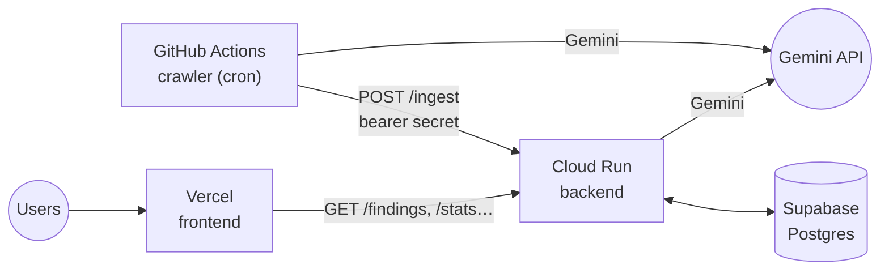
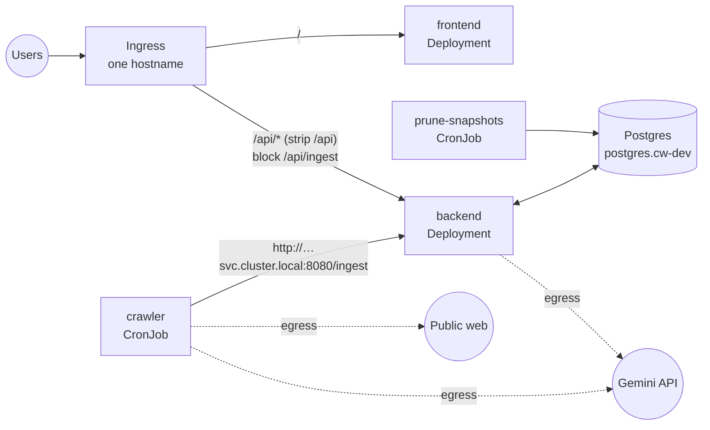
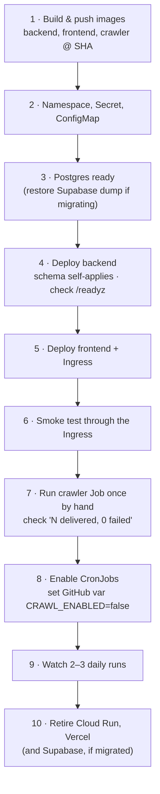

# Handover — Competitor Watch

_Status as of 23 Sep 2026 · branch `dev` (11 commits ahead of `main`)_

Competitor Watch runs a daily crawl that finds news about nine GCC insurers and
the Qatar market. It checks every source, has Gemini judge how much each item
matters, and shows the results on a dashboard. For more detail see
[README.md](README.md), [docs/architecture-confluence.md](docs/architecture-confluence.md)
and [docs/backend-api.md](docs/backend-api.md).

---

## 1. Components

| Component | What it does | Runs on today | Status |
|---|---|---|---|
| **Crawler** `research_crawler/` | Searches with Gemini per keyword, fetches each cited page, turns them into findings and POSTs them to `/ingest` | GitHub Actions: daily at 05:00 UTC, plus a monthly backfill | ✅ Working. No Dockerfile yet |
| **Backend** `backend/` | FastAPI. Deduplicates, classifies with one Gemini call, stores findings with a full audit trail, serves the read API | Cloud Run `competitor-watch-backend` (`me-central1`) | ✅ Live. Has a Dockerfile. Live revision may be behind `dev` |
| **Shared** `shared/` | Wire contract, HTML-to-text, Gemini retry helper used by both of the above | Built into the backend image; the crawler checks it out | ✅ |
| **Frontend** `frontend/` | Next.js dashboard | Vercel | ✅ Live. No Dockerfile yet |
| **Database** | Postgres, 6 tables. Schema applies itself on backend start | Supabase | ✅ Live. Target is in-cluster Postgres |
| **Maintenance scripts** `backend/scripts/` | `prune_snapshots.py` (retention) and one-off backfills | Run by hand | ⚠️ Prune is not scheduled yet |
| **CI** `.github/workflows/ci.yml` | ruff + pytest; typecheck + test + build for the frontend | GitHub Actions | ✅ 166 Python and 10 frontend tests pass |
| **Stale-crawl alert** `crawl-alert.yml` | Fails if the newest finding is more than 30 h old | GitHub Actions, 08:00 UTC | ⚠️ Needs an API URL reachable from GitHub |

### Today

### Target: one Kubernetes namespace, one origin

---

## 2. Before deployment

Ordered roughly by dependency. Items marked 🔴 block the cutover.

| # | Task | Why | |
|---|---|---|---|
| 1 | Commit the pending env cleanup and merge `dev` → `main` | `main` is 11 commits behind | 🔴 |
| 2 | **Frontend Dockerfile.** Multi-stage, `ARG NEXT_PUBLIC_API_BASE_URL=/api` passed to `next build`. Consider `output: "standalone"` | Doesn't exist. The URL is fixed at build time and ignored at runtime | 🔴 |
| 3 | **Crawler Dockerfile.** Copy `shared/` + `research_crawler/`, run `python -m research_crawler.crawler` | Doesn't exist. Needed to run it as a CronJob | 🔴 |
| 4 | **Ingress.** Send `/` to the frontend and `/api/*` to the backend, **stripping `/api`** | Backend routes have no prefix (`/findings`, not `/api/findings`) | 🔴 |
| 5 | **Block `/api/ingest` at the Ingress** | Once `/api` is stripped, `/api/ingest` reaches `/ingest`. The bearer secret still protects it, but the design says it's internal only | 🔴 |
| 6 | **Keep the read API off the public internet** (internal hostname or SSO gateway) | Read endpoints have no auth by design; access control belongs at the Ingress | 🔴 |
| 7 | **Secrets.** Create a `cw-secrets` Secret with only the 3 secrets, and a `cw-config` ConfigMap with the rest. Generate a new `WEBHOOK_SECRET` | `DEPLOY.md` builds both from the same `.env`, which would put the secrets in the ConfigMap in plain text | 🔴 |
| 8 | **Database decision.** Either keep Supabase (set `DATABASE_URL`, `sslmode=require`) or move to in-cluster Postgres and `pg_dump`/`pg_restore` the Supabase data | `.env.example` already points to `postgres.cw-dev`. Moving without a migration loses history | 🔴 |
| 9 | **Egress.** Allow outbound HTTPS to the Gemini API for backend and crawler, and to the public web for the crawler | The crawler fetches arbitrary news sites | 🔴 |
| 10 | Probes: liveness `/healthz`, readiness `/readyz`. Port 8080 | Already implemented; just wire them up | |
| 11 | CronJobs: crawler daily `0 5 * * *`, backfill `0 5 1 * *` (`SEARCH_WINDOW_DAYS=30`), prune daily | Replace the GitHub Actions schedules | |
| 12 | Push images tagged with the commit SHA, not `:latest` | Lets you tell what's running and roll back | |

---

## 3. Deployment plan

**Smoke test (step 6)**, all through the public hostname:

| Request | Expect |
|---|---|
| `/` | Dashboard loads with findings |
| `/api/healthz`, `/api/readyz` | `200` |
| `/api/crawl-status` | A recent `latest_crawl_at` |
| `/api/findings?window=all&limit=1` | One finding |
| `/api/ingest` | Blocked (404/403) |

**Cutover rules**
- Don't run the GitHub Actions crawler and the CronJob together. Nothing breaks, because the ledger deduplicates, but you pay for Gemini twice. `CRAWL_ENABLED=false` (repo variable) turns off the Actions crawler without editing workflows.
- **Rollback:** Cloud Run and Vercel stay up until step 10, so rolling back means pointing users back at the old URLs. Inside the cluster, `kubectl rollout undo`.
- The stale-crawl alert needs `API_BASE_URL` to be reachable from GitHub. Either give it an internal route or rewrite it as an in-cluster CronJob.
- A first run on an empty database needs a backfill: run the crawler Job once with `SEARCH_WINDOW_DAYS=365`.

---

## 4. Things that will trip you

| Trap | Symptom |
|---|---|
| `NEXT_PUBLIC_API_BASE_URL` set on the pod instead of at build | Frontend calls the wrong URL. It is fixed at build time |
| A leftover `frontend/.env*` during `next build` | Its URL overrides `/api` |
| `WEBHOOK_SECRET` differs between backend and crawler | Every delivery gets a 401; the crawler aborts the run |
| A green crawl run | Doesn't prove data landed. Read the last log line: `N delivered, N failed` |
| `${VAR}` or `KEY= # comment` in `.env` | Copied literally by `kubectl --from-env-file`. A test guards `.env.example` |
| Competitor list edited in only one place | Findings fall into the "market" bucket. Edit `research_crawler/config.py`, `backend/companies.py` and `frontend/lib/companies.ts` together |

---

## 5. Future improvements

| Priority | Improvement | Notes |
|---|---|---|
| High | **Decide on the category overlay** | The classifier overrides the crawler's category on about 7% of findings, and some of those are wrong. Options: revert it, gate it on confidence, or accept it |
| High | **CD pipeline.** Build and push images and deploy from CI on merge to `main` | Today backend deploys are manual `gcloud` commands |
| High | **Observability.** Central logs, a crawl-run dashboard, alerts on non-zero crawler exit | Logs can't be read from the terminal on the current GCP account |
| Medium | Replace the startup advisory lock with a **migration Job** | Current approach is safe, but a Job is the cleaner k8s pattern |
| Medium | **One source of truth for competitors** instead of three files | A test catches drift; nothing at runtime does |
| Medium | **Evaluation set for the classifier** | Model output isn't deterministic; there's no way to measure a model or prompt change yet |
| Medium | Track cost per run from `llm_calls` usage columns | The data is already stored |
| Low | Update `DEPLOY.md` for k8s once live and archive the Cloud Run steps | It documents Cloud Run today |
| Low | Remove unused Next.js starter assets (`public/*.svg`) | Cosmetic |
