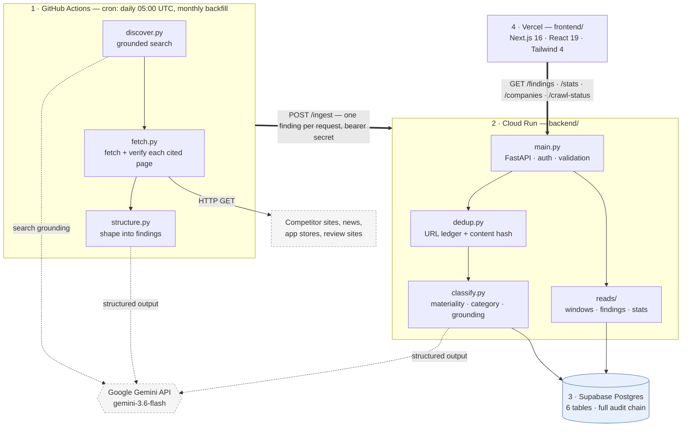
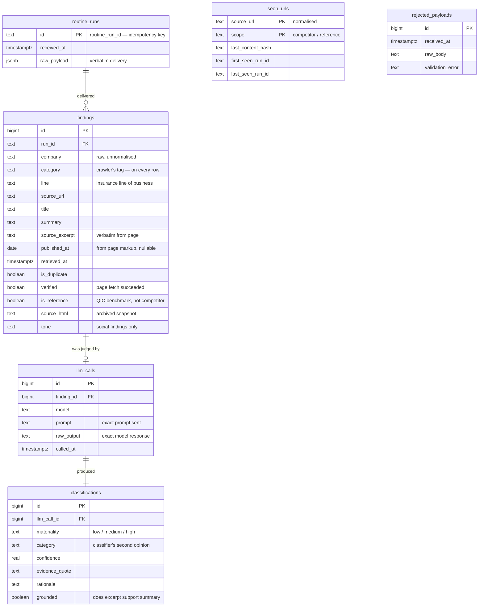
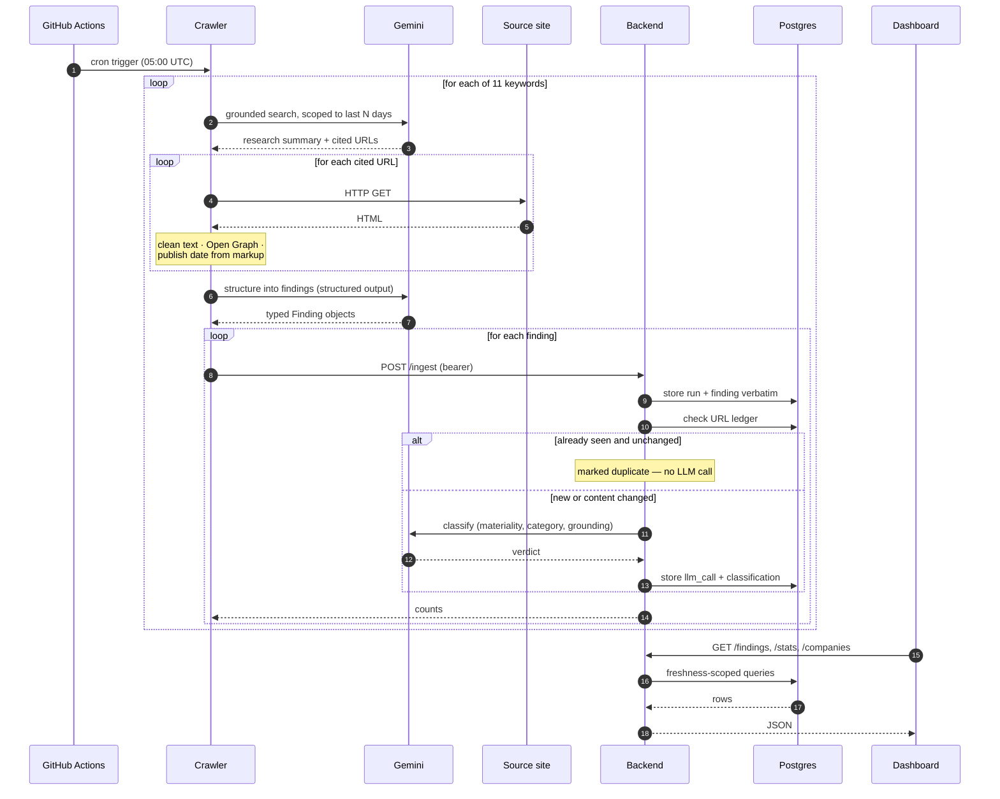
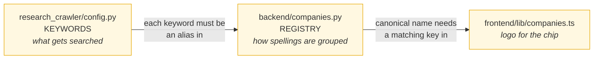

# Competitor Watch — Components, Architecture & Dependencies

> **Rendering note:** the diagrams below are [Mermaid](https://mermaid.js.org/). Confluence Cloud does not
> render Mermaid natively — insert them with the **Mermaid Diagrams for Confluence** app (or any Mermaid
> macro your instance has), or paste the code into [mermaid.live](https://mermaid.live) and attach the
> exported PNG. Everything else on this page is plain Markdown and imports cleanly.

---

## 1. System overview

Competitor Watch is a daily competitive-intelligence pipeline for the Qatar/GCC insurance market. Once a
day it searches the open web for developments at nine tracked competitors, verifies what it finds against
the live source pages, judges how much each item matters, and presents the result as a filterable
dashboard.

The system is built around three deliberate constraints:

| Constraint | Consequence |
| --- | --- |
| **Every claim must be traceable to a source** | The archived page HTML, the exact prompt sent, and the raw model output are all stored. Any item on the dashboard can be traced back to what the model saw. |
| **Novelty is decided in exactly one place** | The crawler re-reports everything it finds on every run. A URL ledger in the backend is the only component that decides "is this new?", so the answer can never be inconsistent. |
| **Nothing is judged twice** | An LLM call is only spent on an item that survived the novelty check, which keeps the daily cost roughly proportional to genuinely new news rather than to crawl volume. |

The four components are deployed independently and communicate only over HTTP and the database — no shared
code, no shared runtime.

---

## 2. Architecture



**Reading the diagram:** solid double arrows are the primary data path; dotted arrows are calls to the
Gemini API. The crawler never touches the database, and the frontend never touches anything but the read
API.

---

## 3. Components

| Piece | What it does | Notes |
| --- | --- | --- |
| `research_crawler/` | Finds and verifies competitor news, once a day | Python · GitHub Actions. No DB access — posts to `/ingest` |
| `backend/` | Dedups, classifies, stores, serves the API | Python · FastAPI · Cloud Run. Only place novelty is decided |
| Database | Findings plus the full audit trail | Supabase Postgres, 6 tables. Schema applied on boot |
| `frontend/` | Dashboard: KPIs, feed, per-finding audit view | Next.js 16 · React 19 · Vercel. Read-only |
| `.github/workflows/` | Runs the crawler on schedule | Daily 05:00 UTC, plus a monthly wider backfill |
| Google Gemini API | Search, structuring, classification | External. `gemini-3.6-flash` — the only paid per-use service |

Three things that are not obvious from the table:

- The crawler makes **two** Gemini calls per keyword — search grounding can't be combined with
  structured output in one call.
- The crawler never judges novelty. It re-reports everything every run; the backend's URL ledger decides.
- Read endpoints have **no auth**. CORS is hygiene, not a security boundary.

### 3.1 How novelty is decided

The cost-control mechanism, and deliberately deterministic — no model involved.

| Situation | Decision |
| --- | --- |
| URL never seen before | New → classify |
| Seen, category is `news` or `social_sentiment` | Duplicate → skip. A published article is written once and not meaningfully rewritten. |
| Seen, category is `product` or `marketing` | Re-hash the page text. A changed hash means the competitor edited their own page — exactly the signal worth catching. |
| Seen, but no page snapshot to compare | Treat as new rather than guess |

The hash covers the page's cleaned text, not the model's chosen excerpt — otherwise "did this page
change?" would depend on which sentence the model happened to quote.

### 3.2 API surface

| Method | Path | Auth | Purpose |
| --- | --- | --- | --- |
| `POST` | `/ingest` | Bearer secret | Accept one crawler delivery. Idempotent on `routine_run_id`. |
| `GET` | `/findings` | none | Filtered, sorted, freshness-scoped feed |
| `GET` | `/findings/{id}` | none | One finding plus its audit trail |
| `GET` | `/findings/{id}/snapshot` | none | Archived source page, served under a CSP sandbox |
| `GET` | `/stats` | none | KPI block with a previous-period delta |
| `GET` | `/companies` | none | Per-company counts for the filter chips |
| `GET` | `/crawl-status` | none | Last delivery timestamp (staleness indicator) |
| `GET` | `/healthz` | none | Liveness probe — touches no dependency |
| `GET` | `/readyz` | none | Readiness probe — 503 when the database is unreachable |

### 3.3 Data model



- `seen_urls` is the dedup ledger — deliberately outside the audit chain, since it describes URLs rather
  than findings.
- `rejected_payloads` catches deliveries that failed schema validation, so a malformed delivery is
  debuggable rather than lost.
- **Only a subset of findings have a `classifications` row.** Duplicates, QIC reference findings, and
  findings whose classify call errored are stored without one. This is why `materiality` can be null and
  why the read queries use outer joins.
- Adding a column means appending `ALTER TABLE ... ADD COLUMN IF NOT EXISTS` and redeploying. Guarded
  renames are possible; dropping or retyping must be done by hand in the Supabase SQL editor.

## 4. Data flow — one finding, end to end



### The freshness rule

Worth documenting because it is the least obvious logic in the system. A finding is dated by its source's
own publish date where one exists. Where it does not, whether crawl time may stand in depends on the
category:

| Category | A missing publish date means | Treatment |
| --- | --- | --- |
| `product`, `marketing`, `social_sentiment`, `other` | Normal — an offer page or app-store listing is evergreen and genuinely undated | Crawl time is used. "We first saw this change today" *is* the news. |
| `news`, `regulatory`, `financial_results`, `investment_or_acquisition` | Extraction failed — a real article always has a publish date | Excluded from time windows |

Without the second rule, articles from previous years appeared in the "this week" view simply because the
crawler had only just discovered them.

---

## 5. Dependencies

### 5.1 External services

| Service | Used for | Notes |
| --- | --- | --- |
| **Google Gemini API** (`gemini-3.6-flash`) | Search grounding, finding structuring, classification | Three call sites; the only paid per-use dependency |
| **Google Cloud Run** | Backend hosting | Project `qic-ai-interns`, region `me-central1` |
| **Google Cloud Build** + Artifact Registry | Backend image build and storage | Images tagged by commit SHA |
| **Google Secret Manager** | Backend secrets | Injected into Cloud Run at runtime |
| **Supabase** | Managed Postgres | Free tier pauses after ~7 days idle; the daily crawl keeps it awake |
| **GitHub Actions** | Crawler scheduling and execution | Two workflows |
| **Vercel** | Frontend hosting | Deployed separately from the backend |

### 5.2 Backend — `backend/requirements.txt`

| Package | Role |
| --- | --- |
| `fastapi` | HTTP framework; also provides query-parameter validation |
| `uvicorn[standard]` | ASGI server |
| `google-genai` | Gemini SDK |
| `psycopg2-binary` | Postgres driver (no ORM) |
| `beautifulsoup4` | HTML-to-text for the dedup content hash |
| `python-dotenv` | Local `.env` loading |

### 5.3 Crawler — `research_crawler/requirements.txt`

| Package | Role |
| --- | --- |
| `google-genai` | Gemini SDK, including the search-grounding tool |
| `requests` | Independent page fetching |
| `beautifulsoup4` | Clean text, Open Graph tags, publish-date extraction |
| `python-dotenv` | Local `.env` loading |

### 5.4 Frontend — `frontend/package.json`

| Package | Version | Role |
| --- | --- | --- |
| `next` | 16.3.0 | Framework (App Router) |
| `react` / `react-dom` | 19.2.8 | UI runtime |
| `@tanstack/react-query` | ^5.101.4 | Data fetching, caching, refetching |
| `@radix-ui/react-select`, `-tabs`, `-collapsible` | ^2.3 / ^1.1 | Accessible primitives |
| `tailwindcss` + `@tailwindcss/postcss` | ^4 | Styling |
| `typescript` | ^5 | Types |

### 5.5 Internal coupling

The two Python components are deployed separately but share one definition of
everything that crosses between them, in `shared/`:

| Module | Contents |
| --- | --- |
| `shared/schemas.py` | The `/ingest` wire contract — `Finding`, `IngestPayload`, and the category/line/tone enums |
| `shared/htmltext.py` | `extract_clean_text()` — both sides must agree, since dedup compares hashes derived from it |
| `shared/gemini.py` | Retry policy and token accounting for all three model calls |

`shared/` imports from neither package and reads no configuration: values that
differ (retry budgets, timeouts) are passed in by the caller. A test enforces
that, so the dependency cannot start running backwards.

> These were three copy-pasted pairs until recently, on the reasoning that
> separately-deployed services should agree on a wire format rather than on
> code. That holds for independently-versioned services; it did not hold here,
> where both live in one repo and change in one commit. Drift showed up only at
> runtime — a rejected delivery, or a content hash that disagreed with itself
> between runs.

Three places must still agree when a competitor is added or removed, and nothing
enforces it:



A keyword that matches no registry alias does not error — it silently falls into
the "Qatar Insurance Market" bucket. A test now catches that case.

---

## 6. Deployment & configuration

| Component | Trigger | Target | Typical duration |
| --- | --- | --- | --- |
| Crawler | Push to `main`, or cron | GitHub Actions runner | ~5–15 min per run |
| Backend | Manual `gcloud builds submit` + `gcloud run deploy` | Cloud Run `competitor-watch-backend` | ~2 min build, ~1 min deploy |
| Frontend | Push | Vercel | ~1–2 min |
| Schema | Automatically, on backend container start | Supabase | Seconds |

### Configuration

One `.env` at the repo root configures every component; `.env.example` is the
committed template and documents all of them. The same file is the source for the
cluster objects (`kubectl create secret/configmap --from-env-file=.env`).

| Variable | Backend | Crawler | Notes |
| --- | --- | --- | --- |
| `POSTGRES_PASSWORD` | ✅ | — | Secret. Used to assemble `DATABASE_URL` when that is not set explicitly |
| `WEBHOOK_SECRET` | ✅ | ✅ | **Must match on both** — a mismatch is a 401, and the crawler now aborts the run rather than logging quiet failures |
| `GEMINI_API_KEY` | ✅ | ✅ | Read by the SDK, not by our config |
| `DATABASE_URL` | ✅ | — | Verbatim when set; otherwise built from the `POSTGRES_*` parts |
| `BACKEND_INGEST_URL` | — | ✅ | Cluster-internal DNS — `/ingest` is not exposed through the Ingress |
| `NEXT_PUBLIC_API_BASE_URL` | — | — | `/api`. **Build-time only** — Next inlines it, so setting it in the pod has no effect |
| `CRAWL_ENABLED` | — | ✅ | Kill switch. `false` stops the crawl before any paid call |
| `SEARCH_WINDOW_DAYS` | — | ✅ | 3 daily, 30 monthly, 365 for a first run |
| `GEMINI_MODEL` | ✅ | ✅ | One model for all three call sites |
| `SNAPSHOT_RETENTION_DAYS` | ✅ | — | Age at which archived page HTML is cleared (default 90) |
| `LOG_LEVEL` | ✅ | ✅ | Case-insensitive |

Per-call limits are set separately for the three model calls, because they do
different work: `DISCOVER_*` (web search — needs reasoning and the longest
timeout), `STRUCTURE_*` (schema shaping — most output tokens, no reasoning), and
`CLASSIFY_*` (one short verdict — the strictest timeout, since it runs inside a
request the crawler is waiting on). Crawl ceilings — `MAX_SOURCES_PER_KEYWORD`,
`MAX_SUMMARY_CHARS`, `MAX_FINDINGS_PER_KEYWORD`, `MAX_FINDINGS_PER_CRAWL`,
`FETCH_CONCURRENCY` — bound one run's cost.

> The file contains no `${VAR}` references by design. python-dotenv expands them,
> but `kubectl --from-env-file` and `docker compose env_file:` copy values
> literally, so one file would mean two different things depending on who read
> it. Nor are there comments on a variable's own line: `KEY=   # hint` parses as
> the value `"# hint"` rather than as empty, which would start the app with a
> hint as its password.

## 7. Known limitations

| Item | Detail |
| --- | --- |
| **Classifier category overlay is imprecise** | The dashboard shows the classifier's category where one exists and the crawler's otherwise. On a 200-row sample this changed 7% of categories — some correctly, but it also retagged a product review away from `social_sentiment`, removing it from that filter. Under review. |
| **Model output is still non-deterministic** | Per-call token, thinking and timeout limits are set, and per-keyword and per-run finding caps exist, so cost is bounded. Quality is not: the same finding can be judged differently on two runs. |
| **Read API is unauthenticated** | By decision: access control lives at the Ingress, which does not expose `/ingest` at all. Anything that can route to the service can read the findings, so the API must not be given a public hostname without a gateway. |
| **A stranded finding is retried, not lost** | A failed delivery is retried 3× (free: `/ingest` is idempotent before classifying). If classification fails, nothing is stored for that finding and the next daily crawl re-reports it. The run exits non-zero, and the stale-crawl alert catches a day where nothing landed at all. |
| **Snapshots expire** | Archived page HTML is cleared after the retention window, so a finding older than that can no longer be re-rendered as the page looked. The verdict, excerpt and audit chain remain. |
| **Three files must agree on the competitor list** | `KEYWORDS`, `REGISTRY` and the frontend logo map (§5.5). A keyword matching no alias does not error, it lands in the market bucket. A test catches it; nothing at runtime does. |

---

## 8. Repository layout

```
competitor_watch/
├─ shared/                    Imported by both deployables
│  ├─ schemas.py              The /ingest wire contract
│  ├─ htmltext.py             HTML to comparable plain text
│  └─ gemini.py               Model retry policy + token accounting
├─ research_crawler/          Scheduled crawler (GitHub Actions)
│  ├─ crawler.py              Entry point
│  ├─ discover.py             Grounded search
│  ├─ fetch.py                Page fetch, date + metadata extraction
│  ├─ structure.py            Shape into findings
│  ├─ config.py               Keywords + env
│  └─ schemas.py              Re-exports shared/, plus FindingsBatch
├─ backend/                   FastAPI service (Cloud Run)
│  ├─ main.py                 HTTP layer
│  ├─ ingest.py               Write path
│  ├─ dedup.py                Novelty decision
│  ├─ classify.py             LLM judgment
│  ├─ db.py                   Schema + SQL
│  ├─ companies.py            Company registry
│  ├─ reads/                  Query layer (windows · findings · stats)
│  └─ scripts/                One-off maintenance jobs
├─ frontend/                  Next.js dashboard (Vercel)
├─ tests/                     pytest suite (no network, no database)
├─ docs/backend-api.md        Full API reference
├─ DEPLOY.md                  Backend deployment runbook
└─ .github/workflows/         Crawler schedules
```

---

## 9. Further reading

| Document | Contents |
| --- | --- |
| `docs/backend-api.md` | Complete API reference: every parameter, response shape, and error |
| `DEPLOY.md` | Backend deployment runbook, including rollback |
| `README.md` | Design rationale and operational notes |
| `frontend/README.md` | Frontend setup |
